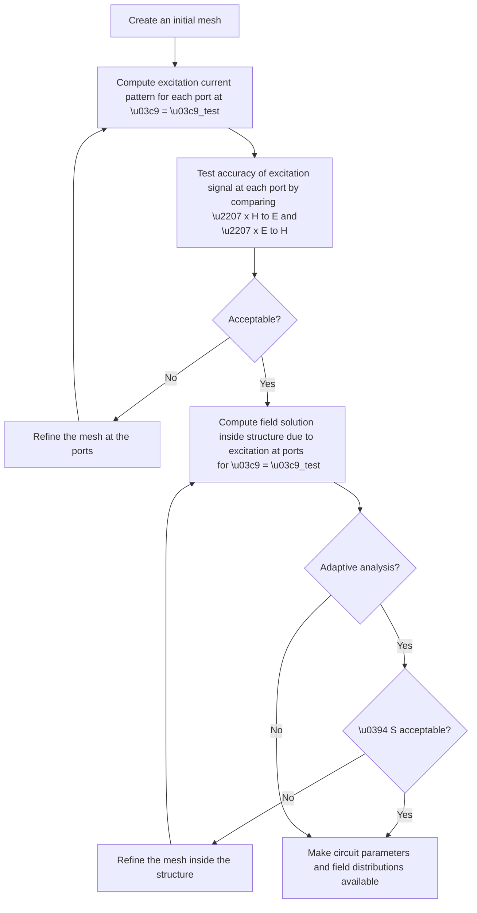

內容介紹
---
這個網站的分享主題專注於模擬、自動化及機器學習的教程和操作指南。這些資料旨在幫助使用者理解和掌握從基礎到進階的智能設計技術，無論是學術研究還是工程應用，都能在這裡找到實用的指導和參考。資料主要以markdown格式提供，結構清晰，適合各級學習者自學和參考。使用者可以透過瀏覽器當中的列印功能自行輸出PDF檔案。透過這些文檔，使用者可以更深入地瞭解如何有效地使用這些軟件工具來進行專業的電磁場設計和分析。

