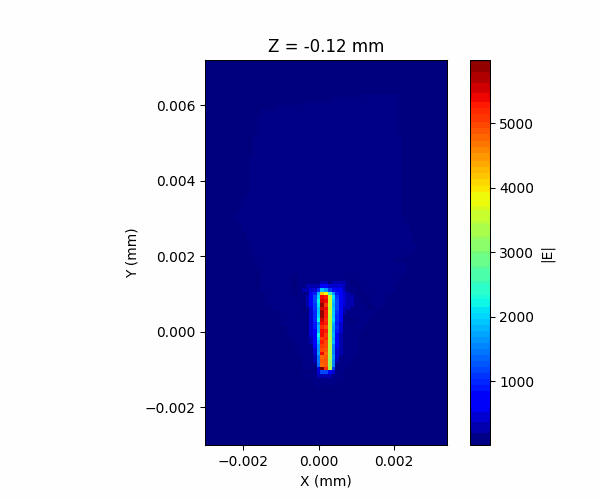

## 3b. 電磁場切片處理


### Prompt
>寫python程式，以0.1為單位將"ComplexMag_E.fld"Z軸切片，輸出場分布圖, jet colormap並連接成.gih檔案，每0.5秒換一張


[檔案下載](./assets/ComplexMag_E.zip)

### 輸出之Python檔案

```python
import os
import numpy as np
import pandas as pd
import matplotlib.pyplot as plt
import imageio.v2 as imageio
from tqdm import tqdm

# 路徑設定
fld_path = "c:/demo/ComplexMag_E.fld"  # 若有完整路徑請修改
img_dir = "c:/demo/field_slices"
gif_path = "c:/demo/ComplexMag_E_slices.gif"
os.makedirs(img_dir, exist_ok=True)

# 讀取資料（跳過前兩行）
df = pd.read_csv(fld_path, skiprows=2, sep=r"\s+", names=["X", "Y", "Z", "E"])

# 資料清洗
df["E"] = pd.to_numeric(df["E"], errors="coerce")
df.dropna(subset=["E"], inplace=True)

# Z 切片列表
z_unique = np.sort(df["Z"].unique())

# 圖片儲存與繪圖
filenames = []
for i, z_val in enumerate(tqdm(z_unique)):
    df_slice = df[np.isclose(df["Z"], z_val)]
    pivot = df_slice.pivot(index="Y", columns="X", values="E")
    if pivot.isnull().values.all():
        continue

    plt.figure(figsize=(6, 5))
    plt.imshow(pivot.values.astype(float), origin="lower", cmap="jet",
               extent=[pivot.columns.min(), pivot.columns.max(),
                       pivot.index.min(), pivot.index.max()])
    plt.title(f"Z = {z_val*1000:.2f} mm")
    plt.colorbar(label="|E|")
    plt.xlabel("X (mm)")
    plt.ylabel("Y (mm)")

    filename = os.path.join(img_dir, f"slice_{i:03d}.png")
    plt.savefig(filename, dpi=100)
    plt.close()
    filenames.append(filename)

# 產生 gif
with imageio.get_writer(gif_path, mode='I', duration=0.5) as writer:
    for filename in filenames:
        image = imageio.imread(filename)
        writer.append_data(image)

print(f"✅ GIF 已輸出：{gif_path}")


```



### 附註
```python
import os
from ansys.aedt.core import Hfss

output_dir = 'c:/demo'     # 輸出資料夾
field_name = 'ComplexMag_E'              # 欲擷取的場值欄位
grid_step = 0.1                 # 場值擷取用的網格解析度
slice_step = 1.0                  # 切片位置的間距

hfss = Hfss(version='2025.1')
x0, y0, z0, x1, y1, z1 = hfss.modeler.get_model_bounding_box()

hfss.post.fields_calculator.export(
    field_name,
    grid_type='Cartesian',
    output_file=os.path.join(output_dir, 'data.fld'),
    grid_start=(x0, y0, z0),
    grid_stop=(x1, y1, z1),
    grid_step=(grid_step, grid_step, grid_step),
    is_vector = True
)
```