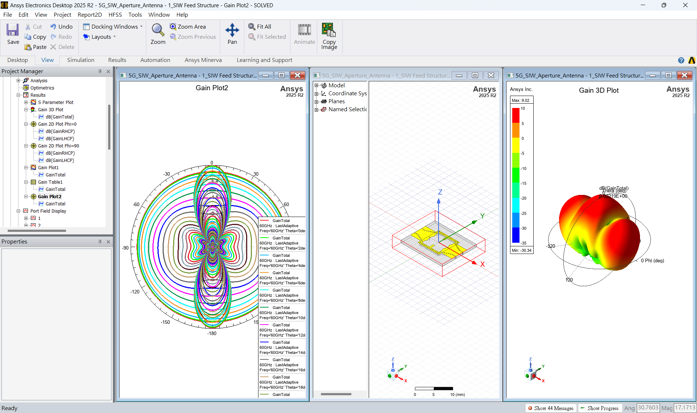
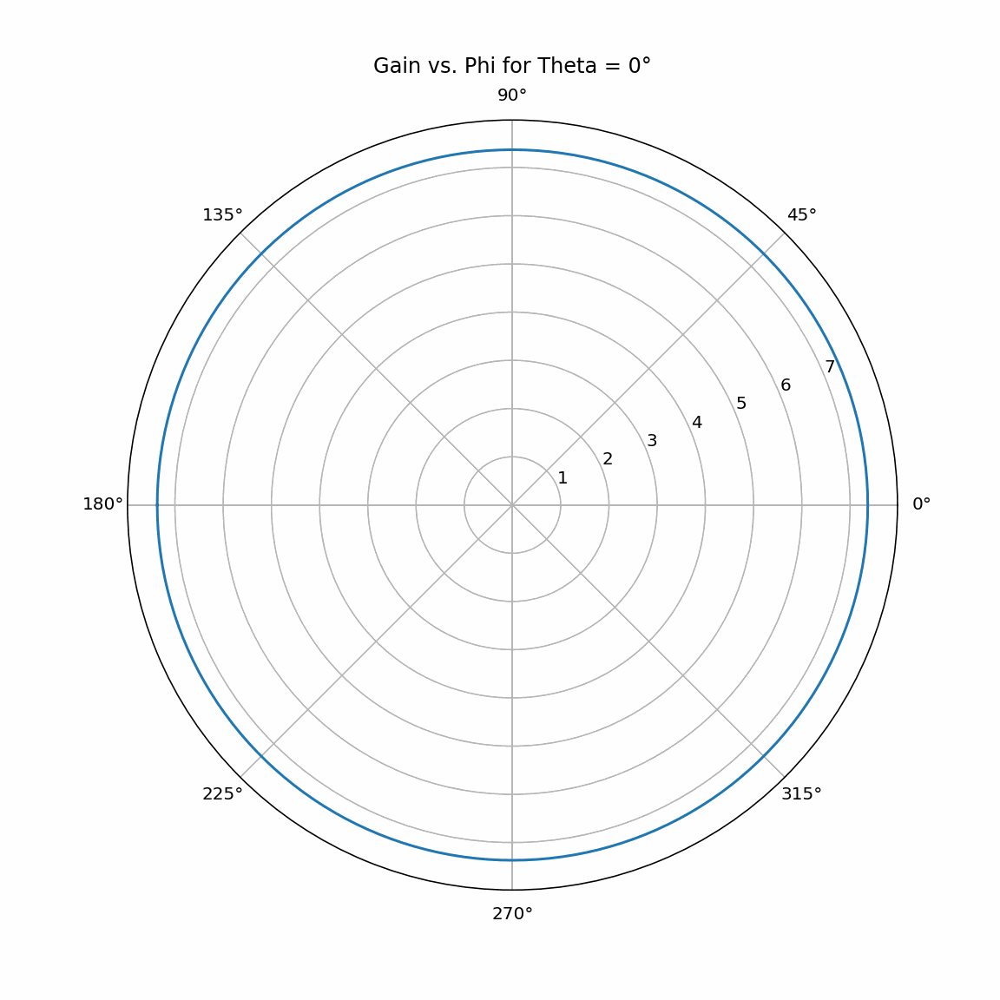

## 4c. 天線增益Polar Chart




[檔案下載](./assets/Gain%20Table1.csv)
### Prompt

> 寫python程式，將不同theta時， gain vs phi的polar chart組成gif。polar chart scale保持不變

### Python
```python

import pandas as pd
import numpy as np
import matplotlib.pyplot as plt
import imageio
import os
import glob
from IPython.display import Image

# 讀取您提供的 CSV 數據
df = pd.read_csv('Gain Table1.csv')

# 將 'Phi [deg]' 轉換為弧度
df['Phi [rad]'] = np.deg2rad(df['Phi [deg]'])

# 找到 GainTotal 的最大值以固定極座標圖的尺度
max_gain = df['GainTotal []'].max()

# 獲取所有唯一的 theta 值並排序
thetas = sorted(df['Theta [deg]'].unique())

# 創建一個目錄來保存圖片
output_dir = 'polar_plots'
if not os.path.exists(output_dir):
    os.makedirs(output_dir)

# 為每個 theta 值生成一個極座標圖並保存
filenames = []
for i, theta in enumerate(thetas):
    plt.figure(figsize=(8, 8))
    ax = plt.subplot(111, polar=True)
    
    # 篩選出當前 theta 的數據
    df_theta = df[df['Theta [deg]'] == theta].sort_values('Phi [rad]')
    
    # 繪製極座標圖
    ax.plot(df_theta['Phi [rad]'], df_theta['GainTotal []'])
    
    # 設置極座標的半徑範圍
    ax.set_rlim(0, max_gain)
    
    # 設置標題
    ax.set_title(f'Gain vs. Phi for Theta = {theta}°', va='bottom')
    
    # 儲存圖片
    filename = f'{output_dir}/frame_{i:03d}.png'
    filenames.append(filename)
    plt.savefig(filename)
    plt.close()

# 從保存的圖片創建 GIF
gif_path = 'gain_animation.gif'
with imageio.get_writer(gif_path, mode='I', duration=0.2) as writer:
    for filename in filenames:
        image = imageio.imread(filename)
        writer.append_data(image)

# 刪除暫存的圖片檔案
for filename in filenames:
    os.remove(filename)
os.rmdir(output_dir)

print(f"GIF 動畫已生成並保存為: {gif_path}")

# 顯示生成的 GIF
Image(open('gain_animation.gif','rb').read())

```

### 輸出
