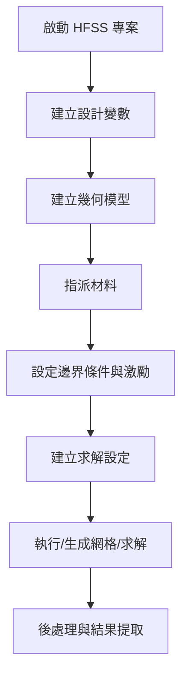

第3章 PyAEDT套件概要
---

### 3.1 建立PyAEDT物件
這裡我們開始一個簡單腳本的練習, 首先在IDE當中輸入以下程式碼並執行：
```python
import pyaedt
​
print(dir(pyaedt))
```

pyaedt模組中導入了所有可用的類別和方法。在這個模組中，你可以看到對應於各種ANSYS產品的類別，如Hfss（高頻結構仿真系統）、Edb（電路板資料庫）、Maxwell3d（電磁場仿真軟體）等等。
```
['Circuit', 'Desktop', 'Edb', 'Emit', 'Hfss', 'Hfss3dLayout', 'Icepak', 'Maxwell2d', 'Maxwell3d', 'MaxwellCircuit', 'Mechanical', 'Q2d', 'Q3d', 'Rmxprt', 'Simplorer', 'Siwave', 'TwinBuilder', '__builtins__', '__cached__', '__doc__', '__file__', '__loader__', '__name__', '__package__', '__path__', '__spec__', '__version__', '_pythonver', '_retry_ntimes', 'aedt_logger', 'constants', 'data_handler', 'downloads', 'general_methods', 'generate_unique_folder_name', 'generate_unique_name', 'generate_unique_project_name', 'generic', 'get_pyaedt_app', 'inside_desktop', 'is_ironpython', 'is_linux', 'is_windows', 'launch_desktop', 'misc', 'modeler', 'online_help', 'os', 'pyaedt_function_handler', 'pyaedt_logger', 'pyaedt_path', 'settings', 'version']
```
這些類別可以讓你使用Python來操作和自動化相對應的ANSYS軟體。每一個類別都提供了一套方法，讓你可以設定模擬、運行模擬、分析結果等等。如果我們只需要使用到單一一套軟體，比方說HFSS，我們可以刪除原本代碼，並輸入以下代碼：

```python
from pyaedt import Hfss
​
# 創建一個新的Hfss物件
hfss = Hfss(specified_version='2023.2')​
```

Hfss是pyaedt套件中的一個類別，這個類別用來對應ANSYS HFSS的軟體功能。在Python中，類別名稱通常會使用駝峰命名法，也就是說，類別的名字開頭會是大寫字母。這是Python的一個慣例，雖然不是強制的，但大部分的程式設計師都會遵守。所以你會看到Hfss這個類別的H是大寫的。

使用這個類別，你可以創建一個新的Hfss物件(物件名為hfss)，並使用它來控制和自動化ANSYS HFSS的功能。創建Hfss物件時，你可以指定你想要使用的ANSYS HFSS軟體的版本。在代碼中指定了使用'2023.2'這個版本。執行上面代碼，成功的話會開啟新的AEDT專案，並在專案當中建立一個新的HFSS設計。

最後輸入以下代碼並執行：

```python
hfss.save_project('c:/demo/test.aedt')
​
hfss.close_desktop()
```

這個方法將會將你的HFSS專案儲存到c:/demo/test.aedt這個路徑。你需要確保這個c:/demo路徑是存在的，否則可能會發生錯誤。close_desktop方法用來關閉ANSYS的Desktop應用。呼叫這個方法後，ANSYS的Desktop應用將會被關閉，所有的未儲存的專案也將會被關閉。

#### 斷開程式與AEDT之連結
當程式完成工作，可以用save_project()來儲存檔案。最後可以用release_desktop()斷開與AEDT連結，可以用close_desktop參數來關閉AEDT。
```python
hfss.save_project()
hfss.release_desktop(close_desktop=False)
```

### 3.2 程式碼與AEDT連結模式
當使用 PyAEDT 來操作 AEDT (Ansys Electronic Desktop) 時，了解如何正確連接到不同的3D結構和設計是關鍵。PyAEDT 提供了多種方式來建立與 AEDT 的連接，以滿足不同的使用場景，如創建新設計、修改現有物件、批量處理模型，或在遠端電腦上進行模擬等。以下是一些主要的連接方法： 
1. **連結全新檔案** ： 
- 當 AEDT 未在運行時，使用 `Hfss()` 可以啟動 AEDT 並創建一個全新的專案與設計。例如：

```python
hfss = Hfss()
```

這會自動開啟 AEDT 並創建一個新的專案。 

2. **連結存在且未開啟的檔案** ： 
- 當指定專案和設計名稱，如果這些文件已存在，PyAEDT 會開啟並連接到它們。例如：

```python
hfss = Hfss(projectname='c:/xxx.aedt', designname='yyy')
```

這行代碼會尋找並開啟指定路徑和名稱的專案。 

3. **連接已開啟的檔案** ： 
- 如果 AEDT 已經在運行，且特定的專案和設計處於活動狀態，執行 `Hfss()` 時，會自動連接到該活動設計。例如：

```python
hfss = Hfss()
```

若 AEDT 正在運行且有活動設計，這行代碼會連接到該設計。 

4. **連接多個檔案** ： 
- 通過指定 `designname` 參數，可以連接到特定的設計。這對於同時處理多個設計非常有用。

這些方法讓 PyAEDT 成為一個靈活且強大的工具，可以應對各種 AEDT 相關的自動化和腳本化任務。

### 3.3 PyAEDT架構

在應用層次，PyAEDT 定義了一系列應用類別，每個類別對應 AEDT 的一種設計環境。例如：Hfss 類別對應 HFSS 電磁場模擬，Icepak 類別對應熱分析模擬，Maxwell3d/Maxwell2d 對應 Maxwell 3D/2D 求解器，Circuit 對應電路模擬 (Nexxim)，Hfss3dLayout 對應 HFSS 3D Layout，等等​

每個應用類別都擁有一個 modeler 屬性，指向其內部的建模器對象。以 HFSS 為例，hfss.modeler 是 Modeler3D 類別的實例，用於創建和操作3D幾何模型​。此 Modeler3D 類別接受一個參數 application（即父應用對象），並將自己綁定到該 HFSS 實例​。

類似地，hfss.mesh 可能對應 Mesh 操作的物件，hfss.boundaries 管理邊界條件的物件，hfss.setup 或相關方法管理求解設定的物件，hfss.post 管理後處理 (結果報表、場景繪圖) 的物件等等。這些子物件在應用類別初始化時自動建立並關聯父物件，形成物件組合的架構。例如，Materials 類別會在 HFSS 等應用中以屬性方式提供：hfss.materials 對應材料資料庫操作​；Variable 管理器則通過 hfss.variable_manager 訪問，以統一管理專案和設計變數​。

AEDT 的 API 採用Python 慣用的命名與操作風格，將 AEDT 較繁瑣的腳本命令包裝成直觀的方法或屬性。例如，設置變數可以透過物件的索引操作完成：hfss["W"] = "5mm" 會建立或修改名為 W 的設計變數，而加上 \$ 前綴如 hfss["\$H"] = "10mm" 則設定專案級變數​

同樣地，AEDT 操作常被封裝為方法，如 hfss.save_project("path") 來保存工程，或 hfss.analyze() 來執行求解。許多操作也透過屬性提供更簡潔的界面，例如 hfss.materials["Copper"] 可直接存取名為 Copper 的材料對象，hfss.setup 列表可取得所有設定，hfss.results 或 hfss.post 用於後處理提取結果。這些設計讓使用者用 Python 物件的語意來操作 AEDT，而不需關注底層的 AEDT API 語法差異，達到直觀且 Pythonic 的使用體驗​。

#### HFSS為例
HFSS (High Frequency Structure Simulator) – 作為3D電磁場模擬工具，HFSS 的 PyAEDT 實現封裝在 Hfss 類別中。透過此物件，使用者可以完成從幾何建模到電磁分析的全流程操作。幾何建模方面，Hfss.modeler 提供建立三維物件的方法，例如建立長方體、圓柱、波導等（如 create_box, create_cylinder），並可指定材料屬性與名稱​。建立的幾何物件由 PyAEDT 返回 Python 對象 (如 Box)，可以訪問其屬性（例如邊、面的列表等）以進一步操作。

邊界條件與激勵方面，Hfss 類別內建許多封裝方法，例如 assign_material 用於對物體賦予材料，assign_radiation_boundary_to_objects 用於對選定物件施加輻射邊界，assign_voltage_source_to_sheet 在選定的面上設置電壓源，assign_lumped_rlc_to_sheet 可在面上定義集總RLC邊界等等​。

這些方法呼叫底層 AEDT 的對應模組（如 BoundarySetup 模組）的 API 來建立邊界條件，但對使用者來說僅需傳入 Python 端的物件或名稱及參數即可完成配置。HFSS 求解設定則通過 create_setup 方法生成設置對象（Setup），其 props 字典包含頻率、收斂準則等設定，可直接以 Python 字典方式修改​。

此外，Hfss 類別提供 analyze() 方法執行當前設計的求解，以及各種後處理接口。例如，hfss.post 下有 create_fieldplot_volume 等方法可在 AEDT 中創建場分布圖並匯出圖片​；hfss.get_traces_for_plot() 和 hfss.post.create_report() 可用於提取結果曲線數據，進而透過 get_solution_data() 取得數值結果​。

總體而言，PyAEDT 對 HFSS 的關鍵功能——建模、設邊界、設置、求解、結果——都提供了高階封裝，方便在 Python 腳本中完成完整模擬流程。

### 3.4 利用dir()及help()探索模組與方法

在 Python 中，我們可以利用內建的 `dir()` 與 `help()` 函式來探索與學習 PyAEDT 模組內部的物件和方法，這對初學者來說是一個非常實用的技巧。以下是詳細的說明與範例：

---

1. 使用 `dir()` 探索物件屬性與方法 
- **功能說明** ：
`dir()` 可以列出一個模組、物件或類別中所有可用的屬性與方法。當你不清楚某個物件有哪些功能時，可以先用 `dir()` 來查看所有可訪問的項目。
 
- **範例說明** ：
假設你已經安裝了 PyAEDT，並且想了解 `ansys.aedt.core` 模組中的內容，可以這樣操作：

```python
import ansys.aedt.core as aedt

# 列出 aedt 模組中的所有屬性與子模組
print(dir(aedt))
```
這樣你可以看到模組中有哪些子模組，例如可能包含 `hfss`, `icepak`, `maxwell` 等，進而決定下一步要探索哪一個部份。


---

2. 使用 `help()` 查詢詳細說明 
- **功能說明** ：
`help()` 函式可以顯示一個物件或函式的說明文檔，提供參數、回傳值、用途等詳細資訊。這對於理解某個方法如何使用非常有幫助。
 
- **範例說明** ：
假設你想深入了解 `Hfss` 類別的功能，可以這樣操作：

```python
from ansys.aedt.core import Hfss

# 查看 Hfss 類別的詳細說明
help(Hfss)
```
執行後，Python 會顯示 `Hfss` 類別的說明、建構子參數、方法列表與內部實作的說明，讓你了解如何使用這個類別來進行電磁模擬。


---


### 3. 進一步探索模組與子物件 
 
- **範例** ：
若你想進一步了解 `Hfss` 物件內部的子物件（例如 `modeler` 或 `materials`），可以先建立一個 `Hfss` 實例，再對該物件使用 `dir()` 與 `help()`：

```python
from ansys.aedt.core import Desktop, Hfss

# 使用 with 區塊建立 AEDT 桌面與 HFSS 設計
with Desktop("2025.1", new_desktop_session=True, non_graphical=True, close_on_exit=True):
    hfss = Hfss()
    
    # 列出 hfss 物件內的屬性
    print("HFSS 物件屬性：", dir(hfss))
    
    # 查看 modeler 屬性的說明，了解如何建立幾何模型
    help(hfss.modeler)
```

透過這樣的方式，你可以逐層探索 PyAEDT 各個部分的功能與結構，從而更深入了解如何使用這些物件來完成模擬任務。


---


### 小結 
 
- **`dir()`** ：快速列出物件內所有屬性與方法，幫助你發現有哪些可以用的工具。
 
- **`help()`** ：提供詳細的說明與使用說明，讓你理解每個方法或類別的用途與參數需求。

### 3.5 模擬流程

