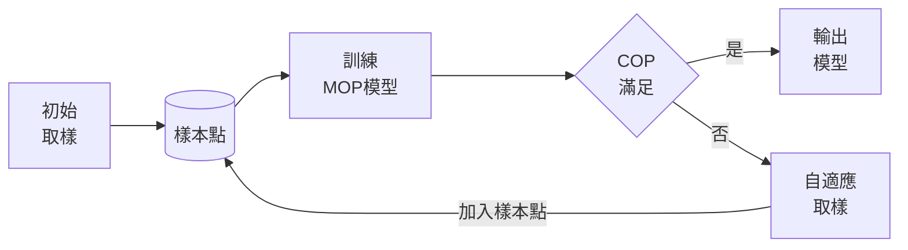

optisLang 數學模型建立
---

### 概論

數學建模是一種將現實世界問題抽象化、使用數學語言和工具來描述和解決這些問題的過程。這個過程涉及幾個關鍵步驟： 

1. **問題定義** :
    - 確定需要解決的具體問題。這可能涉及實際的物理現象、工程問題、經濟情況等。 
2. **建立模型** :
    - 根據問題的性質，選擇合適的數學工具和方法。這可能包括代數方程式、微分方程、統計方法、機器學習算法等。
    - 建立模型涉及將現實世界問題轉化為數學表達式。 
3. **參數確定** :
    - 確定模型中的參數。這可能需要收集數據、進行實驗或使用專家知識。 
4. **解決模型** :
    - 使用數學方法解決模型。這可能涉及數值計算、理論分析或使用計算機軟件。 
5. **模型驗證和改進** :
    - 使用現實世界的數據來檢驗模型的準確性。這可能需要進行實驗或收集更多數據。
    - 根據驗證結果對模型進行調整和改進。 
6. **實際應用** :
    - 將模型應用於實際問題，作出預測、優化決策或提供洞見。 

數學建模是一個動態過程，可能需要多次迭代來改進模型。它在許多領域都有應用，如工程學、經濟學、生物學、醫學等。透過數學建模，我們可以對複雜的現實世界問題進行更深入的理解和有效的解決。

### 數學建模的挑戰

數學建模的根本目標確實是創建一個可以很好地預測未知數據的模型，而不僅僅是與已有的訓練數據吻合。這裡有幾個重要的觀點： 
1. **泛化能力** :
    - 一個好的模型應該能夠對新的、未見過的數據進行有效的預測。這種能力被稱為模型的泛化能力。
    - 如果一個模型只是與訓練數據完美吻合，但對新數據的預測表現不佳，則這個模型被認為過度擬合（overfitting）。 
2. **過度擬合與欠擬合** :
    - 過度擬合發生於模型過於複雜，導致它學習到了訓練數據中的噪聲和偶然特徵，而不是底層的模式。
    - 欠擬合則是模型過於簡單，無法捕捉數據中的關鍵結構。
    - 好的模型需要在這兩者之間找到平衡。 
3. **數據的代表性** :
    - 為了提高模型的泛化能力，很重要的一點是確保訓練數據的代表性。訓練數據應該包含足夠的變化，以涵蓋預期在實際應用中會遇到的情況。 
4. **模型評估** :
    - 通過交叉驗證等方法評估模型，可以幫助我們理解模型在新數據上的表現。
    - 這樣的評估更能反映模型的真實能力，而不僅僅是它在特定數據集上的表現。

總之，數學建模的目的不是創建一個僅在現有數據上表現良好的模型，而是開發出能夠對未知數據作出準確預測的模型。這要求模型不僅要與數據吻合，而且要具有良好的泛化能力，這樣才能在實際應用中發揮最大的價值。

### 自適應取樣

 

取樣對於數據建模至關重要，因為它決定了模型所依賴數據的質量和可靠性。有效的取樣方法能夠保證樣本數據真實地反映了整個母體的特性，這使得從樣本中得出的統計推斷和模型預測可信且具有普遍性。樣本的代表性直接影響到模型的泛化能力，即在新的、未見過的數據上的表現。此外，取樣策略對於處理大數據集時的計算效率也非常重要，因為它可以減少需要分析的數據量，同時保持足夠的信息來建立準確的模型。不恰當的取樣可能導致選擇偏差、過度擬合和模型的不準確預測。因此，選擇恰當的取樣技術對於任何數據建模過程都是基礎且關鍵的步驟。

**自適應取樣**是一種高級的取樣方法，用於數據建模和分析，特別是在面對複雜或高維度問題時。這種方法不同於傳統的固定或隨機取樣技術，它依據先前的結果或模型的反饋動態調整取樣策略。自適應取樣通過在模型的關鍵區域集中更多樣本，來提高模型的精確度和效率，尤其是在那些對預測質量影響最大的區域。這種策略通常用於數據稀疏、不確定性高以及對計算資源要求高的情境，能夠更有效地探索和利用數據空間，從而提高建模和決策過程的整體性能。自適應取樣是一種智能化的取樣方式，它優化了數據收集過程，確保模型學習是以資訊導向和目標導向的方式進行。

這個介面是為了設定和優化AMOP（Adaptive Metamodel of Optimal Prognosis）的行為而設計的。每個區塊允許用戶細化特定的參數來適應元模型的建立過程。以下是四個區塊的功能解釋： 
1. **Adaption（適應）** ： 
    - **細化類型（Refinement type）** ：選擇細化的方式。"Global"代表全局細化，會使用全局取樣方法增加樣本數，直到達到所有響應的目標CoP。 
    - **最大樣本數（Maximum number of samples）** ：設定最大樣本數量上限，這裡設定為300。 
2. **Start iteration（開始迭代）** ： 
    - **使用起始設計（Use start designs only）** ：如果勾選，則第一次迭代只使用起始設計作為支持點。 
    - **取樣類型（Sampling type）** ：指定初次迭代的取樣方法，這裡選擇的是"Space filling Latin Hypercube Sampling"，這是一種高效的空間填充取樣方法。 
    - **樣本數（Number of samples）** ：指定初次迭代的樣本數量，這裡設定為100。 
3. **Refinement（細化）** ：
    - 與開始迭代相似，這裡設定迭代過程中細化步驟的取樣類型和樣本數量。 
4. **Convergence Criteria（收斂標準）** ： 
    - **目標CoP（Target CoP）** ：設定收斂的目標CoP值，這裡是0.9，表示模型的預測品質必須達到這個水平才算收斂。 
    - **最大迭代次數（Maximum iterations）** ：設定最大迭代次數，這裡是3次，如果達到這個次數還未收斂，則停止迭代。 
    - **停滯迭代次數（Stagnation iterations）** ：在單目標優化的局部標準細化中，如果在指定的迭代次數內沒有進步，則停止細化，這裡也設定為3。

這些設定讓使用者可以精確控制AMOP節點的行為，以找到最優的模型參數和結構，從而達成最佳的預測性能。

### MOP數學模型

這份文件詳細介紹了在多目標優化（MOP）競賽中，用於標量輸出的各種模型。我們可以根據不同的需求和應用場景，選擇合適的模型： 
1. **多項式回歸（Polynomial Regression）** ：
    - 使用一階和二階基函數。
    - 適用於小至大型樣本數據集。
    - 訓練和預測速度快，是最簡單但也最快的模型。 
2. **移動最小二乘法（MLS）** ：
    - 使用一階和二階基函數。
    - 訓練時間較長，但適用於高達2000個樣本的數據集。
    - 在近似上速度快。 
3. **普通克里金法（Ordinary Kriging）** ：
    - 分為等向性和各向異性兩種核函數。
    - 各向異性克里金法在大於1000個樣本時訓練效率降低。
    - 訓練和近似速度都快。 
4. **遺傳聚合響應面（GARS）** ：
    - 適用於小型數據集，訓練時間隨樣本增加而急劇上升。
    - 重點在於質量，不支持FMU導出。 
5. **支持向量回歸（SVR）** ：
    - 適用於大型數據集（高達5000個樣本）。
    - 重點在於質量，不支持FMU導出。 
6. **深度前饋網絡（DFFN）** ：
    - 適用於大於1000個樣本的大型數據集。
    - 訓練效率高，特別是在其他模型變得低效時。
    - 不支持FMU導出。 
7. **深度無限混合高斯過程（DIM-GP）** ：
    - 是克里金法的進一步發展，使用神經網絡近似的更靈活的協方差矩陣描述。
    - 適用於高達2000個樣本的數據集。
    - 目前不支持變量過濾，也不支持FMU導出。

根據需求，可以選擇不同的模型。如果需要快速訓練和評估，可以考慮多項式回歸或MLS。如果關注模型質量，可以選擇GARS或SVR。對於大型數據集，DFFN是一個不錯的選擇。最後，如果需要一個具有靈活性和高質量的模型，可以考慮DIM-GP。

| Model       | 訓練樣本數量                | 變量過濾         | MOP求解器性能        | FMU導出   | 推薦說明|
|:-------------:|:-------------:|:-----------:|:---------------:|:------------:|:------------:|
| Polynomial  | 全部                        | MOP過濾          | 非常快              | 是         | 快速訓練及快速評估，應始終進行測試。              |
| MLS         | ≤ 2000                     | MOP過濾          | 快                  | 是         | 質量好且訓練及評估快速|
| Isotropic Kriging | ≤ 2000                | MOP過濾          | 快                  | 是         | 質量好且訓練及評估快速|
| Anisotropic Kriging | ≤ 500               | MOP過濾          | 快                  | 是         | 重點是最佳質量快速評估|
| GARS        | ≤ 500                      | MOP過濾          | 中                  | 否         | 重點是最佳質量。                                 |
| SVR         | ≤ 5000                     | MOP過濾          | 中                  | 否         | 重點是最佳質量。                                 |
| DFFN        | ≥ 500                      | 智能布局         | 中                  | 否         | 最適合大型數據集。                               |
| DIM-GP      | ≤ 2000                     | 無               | 慢                  | 否         | 重點是最佳質量。                                 |

在MOP的設定中，「已測試的元模型」（Tested metamodels）選項包含了以下幾種： 
- **Polynomial（多項式）** ：這是一個基於多項式函數的簡單預測模型，適用於快速訓練和評估。 
- **Polynomial + MLS + isotrop. Kriging（多項式 + 移動最小平方 + 各向同性克里金）** ：這個組合將多項式模型與更複雜的模型（如移動最小平方和各向同性克里金）結合起來，以提高模型的準確度。 
- **Polynomial + Deep Feed Forward Network（多項式 + 深度前饋網絡）** ：這個組合加入了深度學習方法，適用於處理大數據集並可能提供更精準的預測。 
- **All internal metamodels（所有內部元模型）** ：這個選項包括了所有內建在MOP軟件中的元模型，提供了一個廣泛的方法來對比不同模型的性能。 
- **All metamodels (incl. externals)（所有元模型，包括外部的）** ：這個選項擴展了範圍，包含了所有可用的內部和外部元模型，為用戶提供最廣泛的選擇。

在選擇「已測試的元模型」時，您應該考慮您的具體需求，如數據集的大小、預測的準確度需求，以及可接受的訓練時間。例如，對於快速原型和初步分析，可能會選擇單純的多項式模型；而對於更複雜的問題，可能會選擇結合多種方法的選項。

### 交叉驗證（Cross Validation）

交叉驗證（Cross Validation）是一種統計學方法，用於評估機器學習模型的泛化能力。在機器學習中，我們通常希望模型不僅在訓練數據上表現良好，同時也能對未見過的數據進行準確的預測。交叉驗證是一種實現這一目的的有效工具。
#### 基本概念 
1. **數據分割** ：在交叉驗證中，原始數據被分割成多個小的數據集。 
2. **訓練與驗證** ：這些數據集被輪流用作訓練數據和驗證數據。例如，我們可能將數據分割為5個子集，然後每次用4個子集來訓練模型，並用剩下的1個子集來評估模型的表現。 
3. **重複過程** ：這個過程被重複多次（一次對每個子集），每次選擇不同的子集作為驗證數據。 
4. **平均結果** ：最後，我們計算模型在所有輪次的驗證集上的表現的平均值，以獲得對模型泛化能力的總體評估。

#### 類型 
1. **K折交叉驗證（K-Fold Cross Validation）** ：這是最常見的形式。在K折交叉驗證中，“K”指的是將數據分割成多少部分。例如，5折交叉驗證將數據分成5部分。 
2. **留一交叉驗證（Leave-One-Out Cross Validation, LOOCV）** ：在這種形式中，如果有N個數據點，每次留下一個數據點作為驗證集，其餘N-1個點用於訓練。這對於數據量非常小的情況很有用。 

在這兩種交叉驗證方法中，數據集被分成多個不同的子集。在K折交叉驗證中，數據集被平均分成K個子集；而在留一交叉驗證中，每次留下一個樣本作為測試集，其餘的作為訓練集。這些方法的共同點是它們都會生成多個不同的模型，用於不同的訓練集和測試集組合。

這些不同的模型並不是最終的產品。它們的目的是為了評估和提供對原始模型設計的有效性的見解。通過在不同的數據子集上訓練和測試，我們可以得到模型性能的更全面和更客觀的評估。這幫助我們了解模型對於不同數據的泛化能力，即它在處理未見過的數據時的表現如何。

一旦交叉驗證過程完成，並且我們對模型設計的有效性有了充分的了解，下一步就是**使用所有可用的數據來訓練最終的模型**。這個最終模型結合了我們在交叉驗證過程中獲得的所有知識，它旨在對新數據提供最佳的預測。

### MOP模型訓練設定

在多目標優化（MOP）的進階設定中，您可以通過選擇「使用進階設定」複選框來訪問更多細節和選項。以下是這些進階設定選項的說明： 
1. **測試類型（Testing type）** ：
    - 選擇測試點的確定方法。
    - 可以選擇平滑模型（如多項式、帶指數權重的MLS或克里金）或插值模型（如帶規則化權重的MLS）。 
2. **近似類型（Approximation type）** ：
    - 單一預測系數（CoPs）通過對最終元模型的基於方差的敏感性分析來估計。
    - 選擇實證重採樣來基於數據生成邊際分佈。 
3. **並行響應的最大數量（Max. responses in parallel）** ：
    - 設置並行計算的最大響應數量。 
4. **使用不完整設計（Use incomplete designs）** ：
    - 選中後，即使部分響應未計算，也使用設計進行元模型的建立。 
5. **在MOP創建後導出FMU（Export FMU after MOP creation）** ：
    - 選中後，將MOP導出為功能模擬單元（FMU）。 
6. **調整邊界（Adapt bounds）** ：
    - 調整結果參數的邊界以適應取樣。 
7. **CoP容忍度（CoP tolerance）** ：
    - 設定選擇更簡單模型的CoP值範圍。 
8. **轉換（Transformation）** ：
    - 啟用或禁用Box-Cox轉換。 
9. **模型（Models）** ：
    - 選擇哪些元模型類型進行測試。 
10. **過濾器（Filter）** ：
    - 設定重要性和相關性過濾器的參數，如顯著性過濾器、重要性過濾器、相關性過濾器和決定系數過濾器。 
11. **算法消息（Algorithm messages）** ：
    - 決定如何顯示算法消息。 
12. **交叉驗證值（Crossvalidation values）** ：
    - 定義交叉驗證值的使用和命名。

這些進階設定為您提供了更多控制MOP元模型建立和評估過程的選項，從而能夠根據特定需求進行細微調整和優化。

### MOP模型建立訊息輸出
完成MOP（多目標優化）模型建立後，Optislang會輸出Log與Algorithm Log兩個日誌。日誌提供了豐富的信息來幫助理解和評估建立的模型。這些日誌資料對於了解模型的性能和適用性至關重要。

#### Log資訊頁面

這段日誌記錄了一系列關於多目標優化（MOP）中不同元模型的性能評估。這裡簡要解釋主要的信息點： 
1. **模型複雜度（Complexity）** ：表示模型的複雜程度，較高的數字通常表示更複雜的模型。 
2. **決定系數（R2）和調整後的決定系數（R2adj）** ：這些指標衡量模型對數據的擬合程度。R2越接近1，表示模型擬合越好。R2adj是考慮模型複雜度後的R2值。 
3. **交叉驗證決定系數（R2CV）** ：用於衡量模型對新數據的預測能力。 
4. **預測誤差（predError）** ：表示模型在預測時的誤差大小。 
5. **變量數量（NumVariables）和係數數量（numCoeff）** ：顯示模型中變量和係數的數量。

從日誌中可以看出，不同的模型類型（如克里金模型、移動最小平方法、多項式回歸等）在這些指標上有不同的表現。例如，某些克里金模型在R2和R2adj上達到1，表明在訓練數據上有非常好的擬合效果，而且交叉驗證決定系數也很高，表明對新數據的預測能力強。

在選擇最佳模型時，這些指標都非常重要。理想的模型不僅需要在訓練數據上有好的擬合表現，同時也要能夠有效地預測新數據。這通常需要在模型的擬合程度和預測能力之間找到一個平衡點。

#### 演算法資訊頁面

提供了一些有關多目標優化（MOP）中使用的模型和它們在處理200個樣本時的結果摘要，其中包括了三個參數（x1、x2、x3）的範圍和取樣邊界，以及不同模型對於響應變量y的預測效果。

這裡的CoD（Coefficient of Determination）指標衡量模型預測值與實際值之間的一致性。調整後的CoD（CoD adjusted）考慮了模型的參數數量以防止過擬合。pred. CoD（預測CoD）則是對未知數據集的預測性能的估計。

**模型比較：**  
- **線性回歸（Linear Regression）** ：顯示了不同階數的線性回歸模型，包括是否包含交叉項（mixed terms）。 
- **移動最小平方（Moving Least Squares, MLS）** ：提供了不同階數和權重（這裡是指數權重）的模型。 
- **克里金（Kriging）** ：使用各向同性核的克里金模型得到了完美的CoD值（1），這意味著模型在訓練數據上有非常好的擬合效果，並且調整後的CoD值也非常高（0.971241），表明它在預測未知數據上可能會有很好的性能。

**參數重要性：** 

所有參數（x1、x2、x3）都被認為是100%重要的，這表明它們在模型的預測中都扮演著關鍵角色。

**最佳元模型（Best Metamodels）：** 

克里金模型（Kriging with an isotropic kernel）在這個情境中被選為最佳元模型，因為它在擬合和預測數據集方面都顯示了優異的性能。

**多項式回歸函數（Polynomial regression functions）：** 

沒有可用的模型函數，可能是因為多項式回歸在這組數據上沒有提供比其他模型更好的性能。

總的來說，基於提供的數據，克里金模型在這組特定的200個樣本上表現最佳，並且應該被視為進行進一步分析的首選模型。在實際應用中，可能還需要考慮計算成本、模型的解釋性和對新數據的預測能力等其他因素。

### 附註

#### 1. Functional Mock-up Unit

FMU（Functional Mock-up Unit）是FMI（Functional Mock-up Interface）標準的一個實體化應用，它是一種封裝了模型的文件，用於模型交換和聯合仿真。一個FMU本質上是一個包含了所有必要信息以在仿真環境中執行的模型的黑盒子。它通過FMI標準來定義如何在不同的仿真工具中交換和操作這些模型。

**FMU包含以下主要組成部分：**  
1. **模型的數學描述** ：通常使用C語言（或其他支持的編程語言）來描述模型的動態行為。 
2. **元數據** ：描述模型的參數、變量和其他屬性的XML文件。 
3. **可選的二進制文件** ：包含預編譯的模型代碼，使其能夠在沒有原始建模工具的情況下運行。 
4. **資源文件** ：可能包括用於模型運行的外部數據或配置文件。

使用FMU的優勢在於： 
- **可攜性** ：FMU可以跨不同的仿真平台移植，因為它們遵循統一的標準。 
- **互操作性** ：FMU允許不同供應商的工具和模型在單一仿真中進行交互，這對於複雜系統的多學科仿真尤為重要。 
- **效率** ：FMU可以進行高效的聯合仿真，因為它們是獨立的並且可以在仿真環境中並行運行。 
- **靈活性** ：FMU可以用於多種用途，包括設計、分析、驗證和優化。

在產品開發過程中，FMU可以用來代表單個組件或整個系統的行為，從而支持從早期設計階段到產品生命週期管理（PLM）的各個方面。這使工程師可以在不同階段檢驗和測試系統的行為，並且有助於促進跨專業團隊之間的合作。FMU廣泛應用於汽車、航空、能源和其他工業領域，特別是在那些涉及複雜控制系統和多物理域交互的場合。